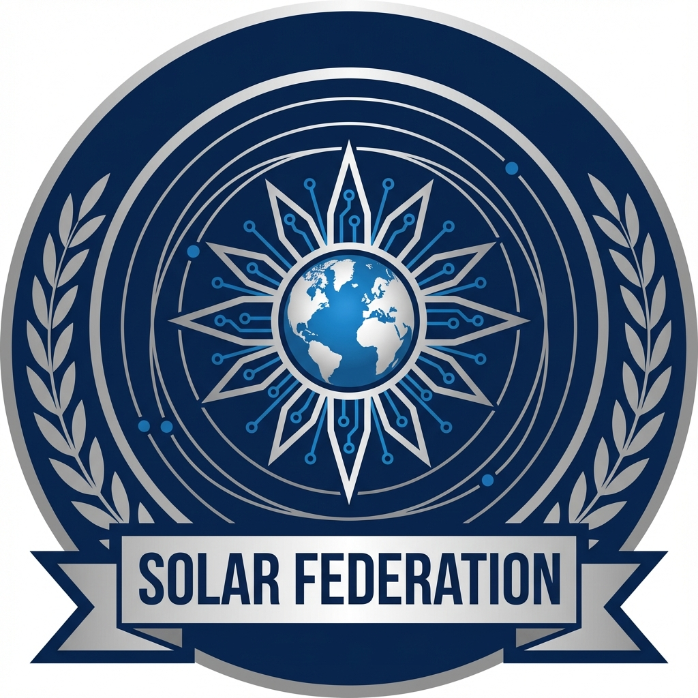
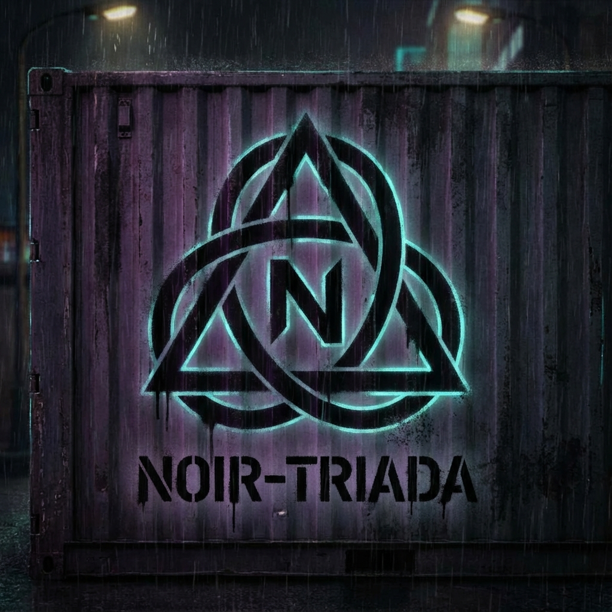
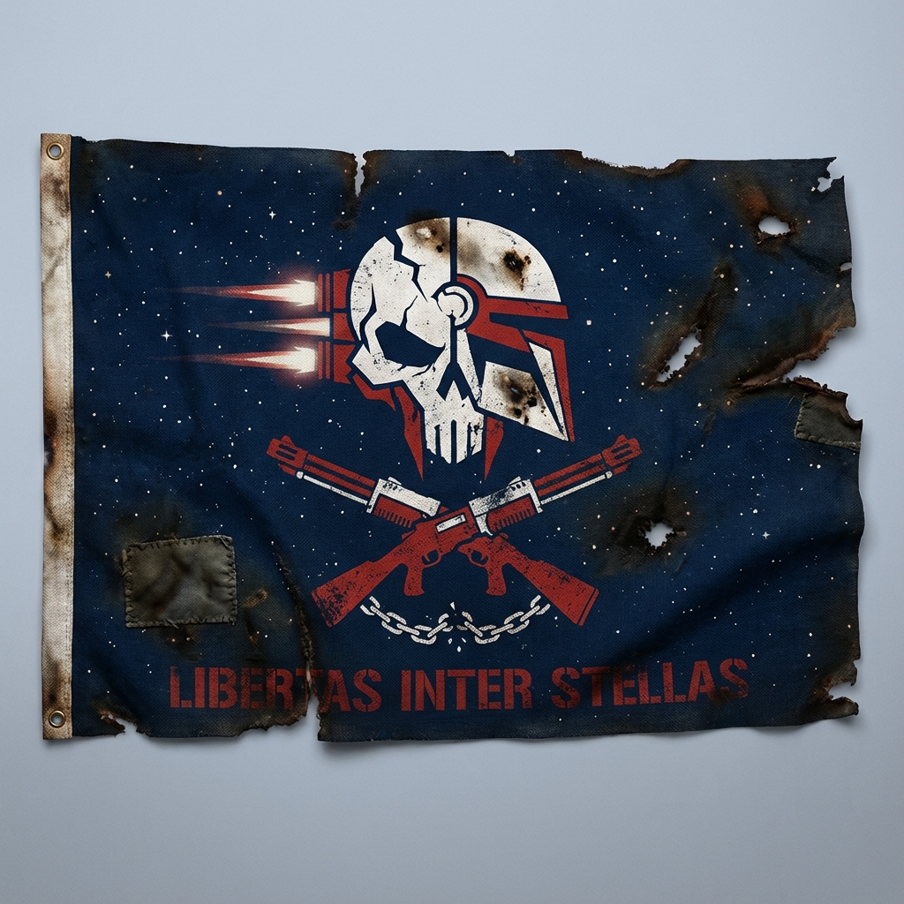
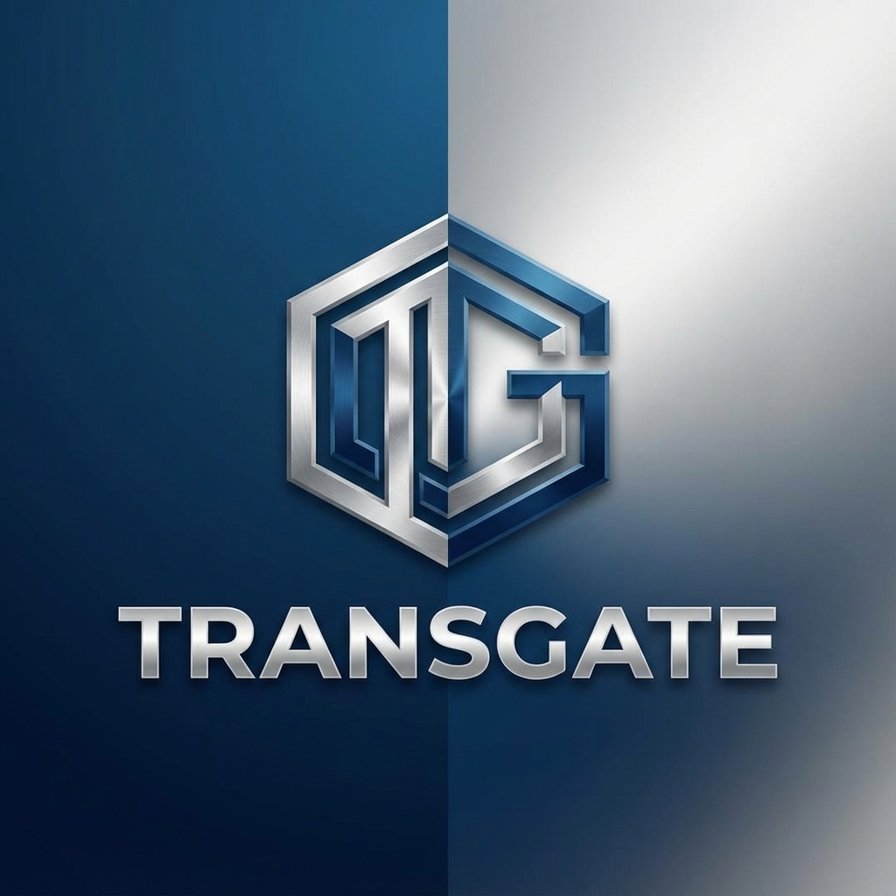

# Фракции 2218 года

Политический ландшафт ранней межзвёздной эры фрагментирован и оспаривается. Ни одна организация не контролирует всё человеческое пространство—вместо этого власть распределена между корпорациями, правительственными коалициями, криминальными сетями и визионерскими движениями.

## Основные фракции

### Правительство и власть

#### [Солнечная Федерация](./solar-federation.md)

Основной правительственный орган, представляющий Землю и внутренние планеты. Контролирует крупнейший флот, устанавливает межзвёздные регуляции и поддерживает технологические запреты. Воспринимается как защитник и угнетатель в зависимости от точки зрения.

**Влияние:** Очень высокое  
**Территория:** Солнечная система, крупные колонии  
**Позиция:** Консервативная, регулирующая

---

### Визионерские движения

#### [Движение Валена](./valen-faction.md)

Возглавляемая харизматичным предпринимателем Кайросом Валеном, эта фракция стремится создать автономные колонии, свободные от надзора Федерации. Публично продвигает прогресс человечества и колонизацию; приватно преследует секретный «Проект Континуум».

**Влияние:** Высокое (растёт)  
**Территория:** Эдем-5, мобильный флот  
**Позиция:** Экспансионистская, против регуляций

---

### Криминальные сети

#### [Нуар-Триада](./noir-triade.md)

Изощрённая сеть контрабандистов, контролирующая маршруты чёрного рынка через прыжковый узел «Триада». Торгует контрабандными технологиями, нелегальными пассажирами и запрещёнными биоматериалами.

**Влияние:** Среднее (подпольное)  
**Территория:** Серые зоны, неуказанные станции  
**Позиция:** Оппортунистическая, нацеленная на прибыль

#### [Пиратские Братства](./pirate-brotherhoods.md)

Слабо организованные группы рейдеров, действующие в плохо защищённом пространстве. Варьируются от отчаявшихся мародёров до организованных военных операций. Некоторые имеют идеологические мотивы помимо простого пиратства.

**Влияние:** От низкого до среднего  
**Территория:** Приграничные системы, пояса астероидов  
**Позиция:** Хищническая, антиправительственная

---

### Корпорации

#### [TransGate](./transgate.md)

Одна из крупнейших транспортных и логистических корпораций. Контролирует ключевую инфраструктуру прыжковых узлов и взимает премиальную плату за налаженные маршруты. Политически нейтральна, но экономически доминирует.

**Влияние:** Очень высокое (экономическое)  
**Территория:** Прыжковые узлы, торговые коридоры  
**Позиция:** Монополистическая, нацеленная на прибыль

#### [Kern Logistics](./kern-logistics.md)

Частная судоходная и грузовая компания. Работает как в легальном, так и в теневом пространстве. Известна дискретностью и готовностью брать рискованные контракты.

### Общественные группы

#### [Ордена Пилотов](./pilot-orders.md)

Религиозные и философские сообщества пилотов, рассматривающие межзвёздные путешествия как духовное призвание. Организуют экспедиции «Пилигримов» для создания колоний, основанных на вере.

**Влияние:** От низкого до среднего  
**Территория:** Различные колонии  
**Позиция:** Идеалистическая, коммунальная

---

## Отношения фракций

Политическая паутина 2218 года сложна:

- **Федерация против Валена**: Идеологический конфликт о регулировании и автономии
- **Корпорации против пиратов**: Экономическая война за судоходные линии
- **Криминальные сети ↔ Корпорации**: Тайные партнёрства и взаимная эксплуатация
- **Ордена Пилотов ↔ Вален**: Непрочный альянс по удобству

Ни одна фракция не является чисто хорошей или злой—каждая действует в рамках собственной моральной системы и стратегических интересов.

---

*Исследуйте отдельные страницы фракций для детального лора, ключевых фигур и нарративных зацепок.*

