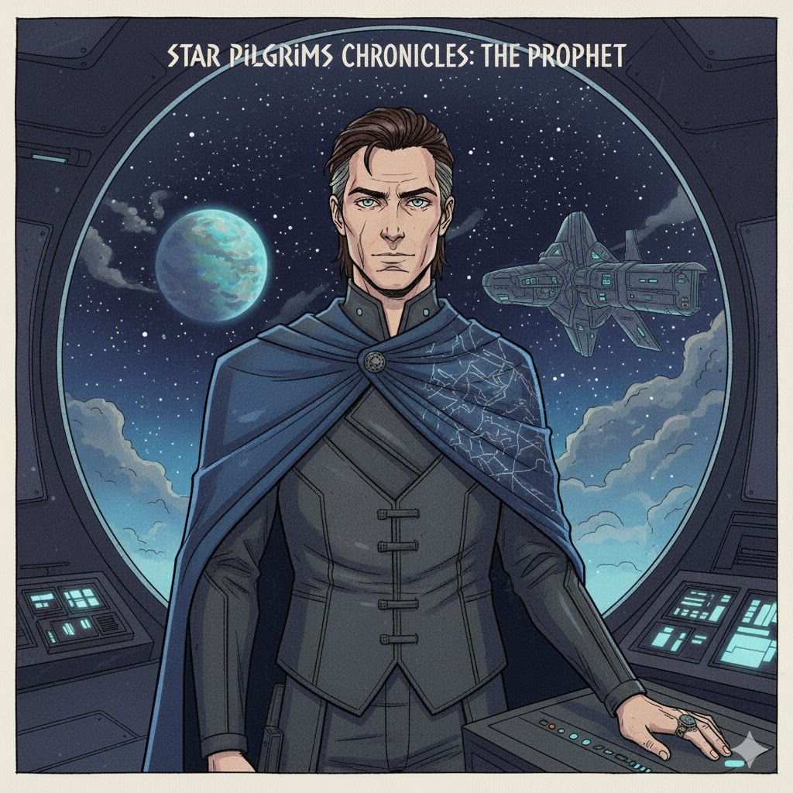


# Кайрос Вален - биография

Кайрос Вален (рабочее имя) - основатель и глава конгломерата "Вален Холдингс" и один из ключевых спонсоров ранних исследований прыжковой технологии. В публичном образе он - филантроп, оратор и визионер: TED-подобные выступления по всему солнечному узлу, щедрые вложения в колонии и научные проекты, массовая благотворительность и широко публичные демонстрации новых технологий.

В приватной реальности Вален - рациональный утилитарист с масштабным, почти математическим подходом к судьбе человечества. В вдохновении он похож на предпринимателя-инноватора (архетип Илона Маска) - агрессивные инвестиции, медиамагнетизм, способность мобилизовать капитал и инженеров; но в планировании он напоминает фигуру из научной утопии (архетип Харри Сэлдона): долгосрочный секретный проект, опирающийся на прогнозы, моделирование и (в крайнем случае) манипуляцию событиями ради "более высокой цели". Эта смесь делает его привлекательным для масс и одновременно опасным для тех, кто видит цену его решений.

Ключевые факты:
- Возраст: 79 лет.
- Нормальная ожидаемая продолжительность жизни в этом обществе - порядка ~110 лет (при доступе к медицинным и биотехнологическим услугам).
- Происхождение: сын инженера и программиста; быстро поднялся в индустрии частных орбитальных инфраструктур.
- Статус: мульти-триллионер, владелец флота инфраструктурных и транспортных активов, глава частной охранной сети и научных корпусов.
- Репутация: публичный меценат и герой колонистов; за кулисами - прагматик, готовый к жестким компромиссам.

Проект и мотивы:
- Секретный проект Валенa, известный в узких кругах как "Континуум" (Project Continuum), предполагает создание набора автономных колоний и сохранение ключевых биосхем и знаний на случай катастрофы. Механика проекта - комбинация научного предвидения (модели развития популяций и экосистем), прямого контроля над ресурсами и тонкой социально-политической инженерии: Вален будет настаивать на особых правилах заселения и управлении новой системой.
- Мораль: Вален искренне считает, что его действия "делают мир лучше" и спасут человечество от вероятной катастрофы; но методы - монопольные права, экономическое давление, тайные операции - создают конфликт с идеалами свободы и самобытности колоний.

Дополнение - технологический конфликт и мотивация:
- Вален открыто противостоит технологическим запретам Солнечной Федерации. Он считает, что официальный моральный консерватизм и страх перед "экзистенциальными рисками" душат прогресс и лишают человечество инструментов для выживания и развития. Конкретные тезисы, формирующие его позицию:
    - Запрет на "сильный" ИИ и жёсткие ограничения на автономию машин тормозят автоматизацию и создание устойчивых колониальных инфраструктур, которые необходимы в отдалённых системах;
    - Запреты на генетику и клонирование лишают учёных инструментов, которые могли бы адаптировать человеческие тела и экосистемы к новым миру - по Валену, это поддерживает статус-кво и концентрирует власть у тех, кто держит ресурсы в метрополиях;
    - Запрет на перенос сознания и "перерождение" делает смерть абсолютной и лишает общества возможностей экспериментировать с долгосрочным накоплением опыта - Вален видит в этом ограничение на эволюцию личности и культуры.

В следствие этого Вален оправдывает использование спорных и порой нелегальных технологий ради "большей цели". Его аргумент: ради выживания и ускоренного развития человечества моральные нормы должны быть переосмыслены. Именно такое убеждение ставит его в прямую конфронтацию с Федерацией, делает многих его действий неприемлемыми для официальной морали, но привлекает радикальных учёных, инвесторов и маргинальные сети, готовые работать "в тени".

Геймплейный эффект: запрет переносов сознания и клонирования - осознанное решение мира. Это позволяет реализовать механики перманентной смерти, перерождения в ограниченном виде или уникальных последствий для персонажей, где "воскрешение" недоступно массово и дорого, а значит смерть в кампании имеет смысл и вес.

Скрытый слой мотивации Валена:
- Несмотря на то, что технологии клонирования и переноса сознания доступны в мире (и поэтому запрещены Федерацией), сам Вален принципиально не использует их для себя - он глубоко боится потерять свою идентичность в случае копирования/переноса. Это делает его действия парадоксальными: публично он продвигает и финансирует исследования спорных направлений и поощряет их применение на практике, но для личного бессмертия он стремится к генетическому решению - настоящему физиологическому долголетию/"генетическому бессмертию", а не цифровому "перерождению". Такая мотивация даёт его образу трагическую глубину: страх смерти и желание сохранить целостность "я" одновременно толкают его на радикальные шаги и создают внутреннее противоречие.

## Секретная директива - Проект "Континуум" (кратко)

1. Заблокировать доступ к био-регионам Эдем-5 до завершения санитарной и инвентаризационной программы.
2. Установить проприетарные права на редкие гены/растения и контролировать их коммерциализацию.
3. Создать автономную управляющую сеть (первичный AI-контроллер) для мониторинга экосистем и обеспечения "стабильности" колонии.
4. В случае политического сопротивления - применять экономические санкции и, при необходимости, короткие спецоперации для устранения руководителей оппозиции.

Эти пункты - неофициальны и официально не подтверждены; игрок и союзники будут находить следы директивы в утечках, судебных документах и показаниях перебежчиков.

## Визуализация / внешний вид (для художников и моделлеров)

Общий облик: харизматичный, одновременно притягательный и отчуждённый; стиль сочетает высокую моду и утилитарную технику.

- Рост: 188 см.
- Телосложение: худощаво-атлетическое, легкая сухость мышц - человек, который много работает и мало расслабляется.
- Лицо: прямой нос, высокие скулы, лёгкая впалость под глазами от недосыпа; тонкие морщины у глаз и лба, которые проявляют опыт и тяжесть решений.
- Волосы: тёмно-каштановые с проседью по вискам, коротко зачёсаны назад; иногда немного длиннее на затылке.
- Глаза: стальной серый, правый глаз с крошечным люминесцентным имплантом в радужке (виден при близком освещении) - лёгкая подсказка к кибернетике.
- Кожа: светлая, с едва заметным загаром от орбитальной экспозиции; небольшая шрамовая полоса на левой щеке (результат инцидента с раннего этапа постройки станции).
- Приметы: тонкая татуировка (семантический знак "∞") за правым ухом, почти всегда скрыта воротником.

Одежда и аксессуары:
- Часто носит сшитый под заказ жилет-кобальт (матовый чёрный или графит), с интегрированной системой управления жестами и динамической тканью, меняющей текстуру (для публичных выступлений - более нарядный вариант).
- Любимый аксессуар: массивное кольцо на указательном пальце правой руки (выглядит как ювелирная вещь с гравировкой), которое он часто крутит во время размышлений.
- Обувь: высокие сапоги с гибкой подошвой, встроенной телекоммуникационной антенной и экстренным модулем связи.
- Флагманский плащ-полупалатка для публичных появлений - тёмно-синего цвета с тонко вышитой схемой звездных коридоров.

Мимика и манеры:
- Говорит спокойно, баритоном с мягким тембром; в речи - выдержанные паузы, тщательно выверенные фразы.
- Любит смотреть прямо в глаза собеседнику - это действует успокаивающе на публику и давит на оппонента.
- Часто использует минимальные жестикуляции: рукой поправляет кольцо, проводит пальцем по подбородку.
- В редких случаях, при раздражении, проявляет холодную расчётливость и короткую, экономную улыбку.

Транспорт и охрана:
- Личный флагман: "Ковчег Кайрос" (мало кто видел его внутри) - тяжёлый, хорошо вооружённый корабль с усиленной системой подавления электронных помех.
- Личная охрана: частный корпус "Вален Страж" - обученные воины и бывшие спецслужбы; небольшие отряды действуют независимо и известны своей эффективностью и скрытностью.

## Игровые точки взаимодействия

- Игрок может увидеть Валена на борту флагмана перед прыжком (публичная встреча) - шанс получить первую подсказку о директиве.
- Утечки в администрацию армады: документы с упоминанием "Континуума" и списка разрешённых зон.
- Перебежчики/работники лаборатории могут рассказать о моральных дилеммах и компромиссах в проекте.

Эта биография даёт отправную точку для сцен, реплик и визуального референса. Кайрос Вален - сложный антагонист/антагонист-меценат: его поступки имеют смысл в его собственной логике спасения человечества, но создают острые конфликты для игроков и колонистов.

